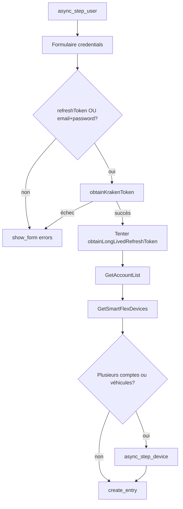

# Intégration Home Assistant — Octopus Energy France (Smart Flex)

Spécification technique **auto-suffisante** pour qu'une IA implémente un custom component Home Assistant `octopus_energy_fr` sans ambiguïté.

**Domaine HA** : `octopus_energy_fr` (distinct de l'intégration UK `octopus_energy` de [BottlecapDave/HomeAssistant-OctopusEnergy](https://github.com/BottlecapDave/HomeAssistant-OctopusEnergy)).

**Source de vérité** : implémentation validée en production dans ce repo :
- `src/lib/octopus/client.ts`
- `src/lib/octopus/types.ts`
- `src/lib/keys/store.ts` (champs settings, lignes 288-321)

**Périmètre v1** : authentification Kraken France + véhicules Smart Flex (recharge intelligente). Pas de tarifs, compteurs ou Octoplus UK.

---

## 1. Différences UK vs France

| Aspect | UK (BottlecapDave) | France (cette spec) |
|--------|-------------------|---------------------|
| Base URL | `https://api.octopus.energy/v1/graphql/` | `https://api.oefr-kraken.energy/v1/graphql/` |
| Auth initiale | API Key (`obtainKrakenToken(input: { APIKey })`) | `refreshToken` **ou** `email` + `password` |
| Header `Authorization` | `JWT {token}` ou token brut selon endpoint | **JWT brut uniquement** — pas de `Bearer`, pas de préfixe `JWT` |
| `User-Agent` | variable | `OctoAppClient/4.134.0 (IOS 26.6; iPhone)` **obligatoire** |
| Corps réponse | JSON standard | Souvent encodé en **base64** (préfixe `eyJ` → décoder avant parse) |
| Créneaux Smart Flex futurs | `flexPlannedDispatches` | Identique — query racine GraphQL |
| Historique recharge | `chargingSessions` | `GetSmartFlexChargeHistory` — **passé uniquement** |

**Avertissement** : ne pas réutiliser le client Python UK tel quel. S'inspirer uniquement de la structure coordinator HA et de `flexPlannedDispatches`.

---

## 2. Constantes et transport HTTP

```python
GRAPHQL_URL = "https://api.oefr-kraken.energy/v1/graphql/"
USER_AGENT = "OctoAppClient/4.134.0 (IOS 26.6; iPhone)"
TOKEN_REFRESH_BUFFER = timedelta(minutes=1)
DEFAULT_SCAN_INTERVAL = 60  # secondes
TIMEZONE_DISPLAY = "Europe/Paris"

DAYS_OF_WEEK = [
    "MONDAY", "TUESDAY", "WEDNESDAY", "THURSDAY",
    "FRIDAY", "SATURDAY", "SUNDAY",
]
```

### Headers HTTP (toutes les requêtes)

```python
headers = {
    "accept": "multipart/mixed;deferSpec=20220824, application/graphql-response+json, application/json",
    "content-type": "application/json",
    "user-agent": USER_AGENT,
}
if operation_name:
    headers["x-apollo-operation-name"] = operation_name
if access_token:
    headers["authorization"] = access_token  # JWT brut, SANS préfixe
```

### Corps requête

```python
body = {
    "query": query_string,
    "variables": variables or {},
    "operationName": operation_name,  # optionnel mais recommandé
}
```

Méthode : `POST` vers `GRAPHQL_URL`.

### Décodage réponse (`parse_graphql_body`)

```python
import base64
import json

def parse_graphql_body(text: str) -> dict:
    json_text = text.strip()
    if json_text.startswith("eyJ"):
        json_text = base64.b64decode(json_text).decode("utf-8")
    body = json.loads(json_text)
    if body.get("errors"):
        messages = "; ".join(e["message"] for e in body["errors"])
        raise OctopusGraphQLError(f"Octopus GraphQL: {messages}")
    if not body.get("data"):
        raise OctopusGraphQLError("Octopus GraphQL: réponse vide.")
    return body["data"]
```

Si HTTP status != 200 : lever `OctopusApiError` avec `f"Octopus API {status}: {text[:300]}"`.

---

## 3. Identifiants et Config Flow

### Champs du formulaire (`async_step_user`)

Identiques à dieudesmcp `/settings` :

| Clé config | Label UI | Type | Requis | Placeholder |
|------------|----------|------|--------|-------------|
| `refresh_token` | Refresh token longue durée (recommandé) | text | non | depuis l'app mobile ou dieudesmcp /settings |
| `email` | Email (si pas de refresh token) | text | non | votre.email@example.com |
| `password` | Mot de passe (si pas de refresh token) | password | non | votre mot de passe |
| `account_number` | Numéro de compte (optionnel) | text | non | A-78F490A5 |
| `device_id` | ID véhicule Smart Flex (optionnel) | text | non | 00000000-0002-4300-8085-000000000f88 |

### Règles de validation

```python
def validate_credentials(data: dict) -> str | None:
    refresh_token = (data.get(CONF_REFRESH_TOKEN) or "").strip()
    email = (data.get(CONF_EMAIL) or "").strip()
    password = (data.get(CONF_PASSWORD) or "").strip()

    if refresh_token:
        return None  # refresh token seul suffit
    if email and password:
        return None
    return "Fournissez un refresh token, ou un email et un mot de passe."
```

- Ne **jamais** exiger email/mdp si refresh token fourni et valide.
- Stocker secrets dans `config_entry.data` (HA chiffre automatiquement).
- Persister le `refresh_token` **roté** après chaque login/refresh via `hass.config_entries.async_update_entry`.
- `unique_id` = `sub` du JWT (champ `sub` du payload) ; fallback `account_number`.
- Test connexion = `obtainKrakenToken` + `GetAccountList` + `GetSmartFlexDevices` (0 device = warning, pas d'erreur bloquante).

### Flux Config Flow



**Steps supplémentaires** :
- `async_step_account` : si plusieurs comptes dans `GetAccountList` et `account_number` absent.
- `async_step_device` : si plusieurs véhicules Smart Flex et `device_id` absent.
- `async_step_reauth` : si `ConfigEntryAuthFailed` (refresh + email/mdp échouent).

### Données stockées

**`config_entry.data`** (secrets) :
```python
{
    "refresh_token": str,      # mis à jour à chaque rotation
    "email": str | None,       # conservé pour fallback
    "password": str | None,    # conservé pour fallback
}
```

**`config_entry.options`** :
```python
{
    "account_number": str,
    "device_id": str,
    "scan_interval": int,  # défaut 60
}
```

**Session runtime** (mémoire coordinator, pas persistée sur disque) :
```python
@dataclass
class SessionState:
    token: str
    refresh_token: str
    refresh_expires_in: int      # timestamp Unix ABSOLU (secondes)
    token_expires_at: int        # timestamp Unix en millisecondes (depuis JWT exp)
    logged_in_at: int
    account_number: str | None
    sub: str | None
    preferred_name: str | None
```

Décoder JWT :
```python
import base64, json

def decode_jwt_payload(token: str) -> dict:
    parts = token.split(".")
    if len(parts) < 2:
        return {}
    padded = parts[1] + "=" * (-len(parts[1]) % 4)
    return json.loads(base64.urlsafe_b64decode(padded))

def decode_jwt_sub(token: str) -> str | None:
    return decode_jwt_payload(token).get("sub")

def decode_jwt_exp_ms(token: str) -> int:
    exp = decode_jwt_payload(token).get("exp")
    if exp is None:
        return int(time.time() * 1000) + 3_600_000
    return exp * 1000
```

---

## 4. Gestion de session (`ensure_session`)

Reproduire exactement la logique de `ensureSessionInner` dans `client.ts` :

```
1. Charger session mémoire (si refresh non expiré)
2. Si pas de session → bootstrap avec refresh_token configuré → perform_token_refresh
3. Si toujours pas de session → perform_login (email + password)
4. Si token expiré (exp - 1 min) :
   a. Tenter perform_token_refresh
   b. Si échec → re-bootstrap refresh_token configuré
   c. Si échec → clear session → perform_login
5. Mutex asyncio.Lock pour éviter refresh concurrents
6. Après login/refresh → tenter obtain_long_lived_refresh_token (try/except, ignorer si Unauthorized)
7. Callback on_token_rotated(new_refresh_token) → mettre à jour config_entry.data
```

```python
def is_refresh_expired(state: SessionState) -> bool:
    return state.refresh_expires_in * 1000 <= time.time() * 1000 + 60_000

def is_token_expired(state: SessionState) -> bool:
    return state.token_expires_at <= time.time() * 1000 + 60_000
```

**Priorité auth** : `refresh_token` configuré > session en mémoire > `email` + `password`.

**Bootstrap refresh token** : si refresh token configuré mais pas de session, créer état provisoire avec `refresh_expires_in = now + 180 jours` (estimation) puis appeler `perform_token_refresh`.

---

## 5. Catalogue GraphQL complet

Toutes les opérations ci-dessous sont **validées** contre `client.ts`. Copier les queries/mutations **verbatim**.

### 5.1 Login — `obtainKrakenToken`

**operationName** : `Login`

**Mutation** :
```graphql
mutation Login($input: ObtainJSONWebTokenInput!) {
  obtainKrakenToken(input: $input) {
    __typename
    refreshExpiresIn
    refreshToken
    token
  }
}
```

**Variables — email/password** :
```json
{
  "input": {
    "email": "votre.email@example.com",
    "password": "votre_mot_de_passe"
  }
}
```

**Variables — refresh token** :
```json
{
  "input": {
    "refreshToken": "44fb36196574239127774e41c43ba4ebc0396cd9338bc156561fcf059acb4ac2"
  }
}
```

**Headers** : pas de `authorization`.

**Réponse attendue** :
```json
{
  "obtainKrakenToken": {
    "__typename": "ObtainJSONWebToken",
    "token": "<jwt>",
    "refreshToken": "<hex_64_chars>",
    "refreshExpiresIn": 1767225600
  }
}
```

`refreshExpiresIn` = timestamp Unix **absolu** (pas une durée relative).

**Usage HA** : config flow, refresh session, reauth.

---

### 5.2 Upgrade refresh longue durée — `obtainLongLivedRefreshToken`

**operationName** : `generateLongLivedRefreshToken`

**Mutation** :
```graphql
mutation generateLongLivedRefreshToken($input: ObtainLongLivedRefreshTokenInput!) {
  obtainLongLivedRefreshToken(input: $input) {
    __typename
    refreshToken
    refreshExpiresIn
  }
}
```

**Variables** :
```json
{
  "input": {
    "krakenToken": "<access_token_jwt>"
  }
}
```

**Headers** : `authorization: <access_token_jwt>` (JWT brut).

**Comportement** : appeler après chaque login/refresh. Si `Unauthorized` ou erreur GraphQL → **ignorer**, conserver le refresh token court retourné par `obtainKrakenToken`. Durée typique refresh longue durée : ~6 mois.

---

### 5.3 GetUser

**operationName** : `GetUser`

**Query** :
```graphql
query GetUser {
  viewer {
    __typename
    id
    preferredName
    email
  }
}
```

**Variables** : aucune.

**Usage HA** : titre de l'intégration (`preferredName`), diagnostic.

---

### 5.4 GetAccountList

**operationName** : `GetAccountList`

**Query** :
```graphql
query GetAccountList {
  viewer {
    __typename
    accounts {
      __typename
      number
    }
  }
}
```

**Variables** : aucune.

**Réponse** :
```json
{
  "viewer": {
    "accounts": [
      { "number": "A-78F490A5" }
    ]
  }
}
```

**Usage HA** : résolution `account_number` si non fourni → prendre `accounts[0].number`. Step de sélection si plusieurs comptes.

---

### 5.5 GetSmartFlexDevices

**operationName** : `GetSmartFlexDevices`

**Query** :
```graphql
query GetSmartFlexDevices($accountNumber: String!, $deviceId: String) {
  devices(accountNumber: $accountNumber, deviceId: $deviceId) {
    __typename
    id
    name
    deviceType
    provider
    propertyId
    status {
      __typename
      current
      isSuspended
    }
    ... on SmartFlexVehicle {
      make
    }
  }
}
```

**Variables** :
```json
{
  "accountNumber": "A-78F490A5",
  "deviceId": null
}
```

Pour un véhicule spécifique : `"deviceId": "00000000-0002-4300-8085-000000000f88"`.

**Usage HA** : découverte véhicules, step de sélection, validation device_id.

---

### 5.6 GetSmartFlexDevicePreferences

**operationName** : `GetSmartFlexDevicePreferences`

**Query** :
```graphql
query GetSmartFlexDevicePreferences($accountNumber: String!, $deviceId: String) {
  devices(accountNumber: $accountNumber, deviceId: $deviceId) {
    __typename
    id
    name
    preferences {
      __typename
      targetType
      unit
      mode
      schedules {
        __typename
        dayOfWeek
        time
        min
        max
        upperLimit
      }
    }
  }
}
```

**Variables** :
```json
{
  "accountNumber": "A-78F490A5",
  "deviceId": "00000000-0002-4300-8085-000000000f88"
}
```

**Interprétation** :
- `schedules[].time` en réponse : format `HH:MM:SS` (ex. `02:00:00`)
- Afficher en HA : tronquer à `HH:MM` (`time[:5]`)
- `mode` typique : `CHARGE`
- `unit` typique : `PERCENTAGE`
- `targetType` typique : `ABSOLUTE_STATE_OF_CHARGE`
- Heure cible utilisateur = même heure sur les 7 jours (vérifier `MONDAY` ou `schedules[0]`)

**Usage HA** : capteur `target_time`, attributs schedules.

**Ce n'est PAS** le créneau réel de recharge planifié par l'optimiseur.

---

### 5.7 FlexPlannedDispatches — créneaux réels planifiés

**operationName** : `FlexPlannedDispatches`

**Query** :
```graphql
query FlexPlannedDispatches($accountNumber: String!, $deviceId: String!) {
  devices(accountNumber: $accountNumber, deviceId: $deviceId) {
    __typename
    id
    name
    status {
      __typename
      ... on SmartFlexVehicleStatus {
        current
        currentState
        stateOfCharge { value }
        activePower { value }
      }
    }
  }
  flexPlannedDispatches(deviceId: $deviceId) {
    start
    end
    type
    energyAddedKwh
  }
}
```

**Variables** :
```json
{
  "accountNumber": "A-78F490A5",
  "deviceId": "00000000-0002-4300-8085-000000000f88"
}
```

**Réponse exemple** (véhicule branché, cible 02:00) :
```json
{
  "devices": [{
    "id": "00000000-0002-4300-8085-000000000f88",
    "name": "Tesla Model 3",
    "status": {
      "currentState": "CHARGING",
      "stateOfCharge": { "value": "45" }
    }
  }],
  "flexPlannedDispatches": [
    { "start": "2026-07-11T22:11:00Z", "end": "2026-07-11T23:00:00Z", "type": "SMART", "energyAddedKwh": -3.18 },
    { "start": "2026-07-11T23:00:00Z", "end": "2026-07-12T00:00:00Z", "type": "SMART", "energyAddedKwh": -7.30 }
  ]
}
```

**Agrégation fenêtre planifiée** :
- `planned_window_start` = `flexPlannedDispatches[0].start` (trié par start asc)
- `planned_window_end` = `flexPlannedDispatches[-1].end`
- Exemple local Paris : `00:11 → 02:00`

**Slot actif** : `start <= now < end`

**Slot à venir** : `start > now`

**PIÈGE CRITIQUE** : `flexPlannedDispatches` est une query **racine** (pas un champ de `devices`). Ne pas chercher les créneaux futurs dans `GetSmartFlexChargeHistory`.

**Condition** : la voiture doit être **branchée** pour obtenir des créneaux non vides. Liste vide = état normal si débranchée.

---

### 5.8 GetSmartFlexChargeHistory — historique passé

**operationName** : `GetSmartFlexChargeHistory`

**Query** :
```graphql
query GetSmartFlexChargeHistory($accountNumber: String!, $deviceId: String, $sessionTypes: [ChargingSessionType], $last: Int, $before: DateTime, $after: DateTime!) {
  devices(deviceId: $deviceId, accountNumber: $accountNumber) {
    __typename
    id
    name
    ... on SmartFlexVehicle {
      chargingSessions(sessionTypes: $sessionTypes, last: $last, before: $before, after: $after) {
        __typename
        edges {
          __typename
          node {
            __typename
            ... on SmartFlexChargingSession {
              start
              end
              type
              stateOfChargeChange
              stateOfChargeFinal
              energyAdded {
                __typename
                value
                unit
              }
              problems {
                __typename
                ... on SmartFlexChargingTruncation {
                  truncationCause
                  achievableStateOfCharge
                }
              }
            }
          }
        }
        pageInfo {
          __typename
          hasNextPage
          hasPreviousPage
        }
      }
    }
  }
}
```

**Variables** :
```json
{
  "accountNumber": "A-78F490A5",
  "deviceId": "00000000-0002-4300-8085-000000000f88",
  "sessionTypes": ["SMART"],
  "last": 10,
  "before": null,
  "after": "2026-07-09T07:00:00.000Z"
}
```

`after` = maintenant - 2 jours (ISO 8601 UTC).

**Usage HA** : attribut `recent_slots` sur capteur planned_dispatches. **Ne pas utiliser** pour afficher la prochaine recharge.

---

### 5.9 SetSmartFlexDevicePreferences — changer l'heure cible

**operationName** : `SetSmartFlexDevicePreferences`

**Mutation** :
```graphql
mutation SetSmartFlexDevicePreferences($input: SmartFlexDevicePreferencesInput!) {
  setDevicePreferences(input: $input) {
    __typename
    id
    name
    preferences {
      __typename
      targetType
      unit
      mode
      schedules {
        __typename
        dayOfWeek
        time
        min
        max
      }
    }
  }
}
```

**Variables** (exemple 02:00, 100 %) :
```json
{
  "input": {
    "deviceId": "00000000-0002-4300-8085-000000000f88",
    "mode": "CHARGE",
    "unit": "PERCENTAGE",
    "schedules": [
      { "dayOfWeek": "MONDAY",    "time": "02:00", "max": 100 },
      { "dayOfWeek": "TUESDAY",   "time": "02:00", "max": 100 },
      { "dayOfWeek": "WEDNESDAY", "time": "02:00", "max": 100 },
      { "dayOfWeek": "THURSDAY",  "time": "02:00", "max": 100 },
      { "dayOfWeek": "FRIDAY",    "time": "02:00", "max": 100 },
      { "dayOfWeek": "SATURDAY",  "time": "02:00", "max": 100 },
      { "dayOfWeek": "SUNDAY",    "time": "02:00", "max": 100 }
    ]
  }
}
```

**Règles** :
- `time` en entrée : `HH:MM` (sans secondes), validation regex `^(\d{1,2}):(\d{2})(?::\d{2})?$`
- `max` entre 1 et 100
- Toujours envoyer les **7 jours** avec la même heure

**Usage HA** : service `octopus_energy_fr.set_charge_target_time`.

---

## 6. Architecture du custom component

```
custom_components/octopus_energy_fr/
  __init__.py           # async_setup_entry, unload_entry, forward platforms
  manifest.json
  const.py              # DOMAIN, CONF_*, DEFAULT_SCAN_INTERVAL
  config_flow.py        # OctopusEnergyFRConfigFlow, OptionsFlow
  api_client.py         # OctopusKrakenClient
  coordinator.py        # OctopusDataCoordinator (DataUpdateCoordinator)
  sensor.py             # capteurs
  binary_sensor.py      # binary_sensor charging
  services.yaml         # set_charge_target_time
  strings.json          # config flow EN
  translations/
    fr.json             # config flow FR
```

### manifest.json

```json
{
  "domain": "octopus_energy_fr",
  "name": "Octopus Energy France",
  "codeowners": ["@votre-github"],
  "config_flow": true,
  "documentation": "https://github.com/votre-repo/octopus_energy_fr",
  "iot_class": "cloud_polling",
  "requirements": ["aiohttp>=3.9.0"],
  "version": "1.0.0"
}
```

### const.py

```python
DOMAIN = "octopus_energy_fr"

CONF_REFRESH_TOKEN = "refresh_token"
CONF_EMAIL = "email"
CONF_PASSWORD = "password"
CONF_ACCOUNT_NUMBER = "account_number"
CONF_DEVICE_ID = "device_id"
CONF_SCAN_INTERVAL = "scan_interval"

DEFAULT_SCAN_INTERVAL = 60
```

### api_client.py — squelette

```python
class OctopusKrakenClient:
    def __init__(
        self,
        session: aiohttp.ClientSession,
        refresh_token: str | None,
        email: str | None,
        password: str | None,
        on_token_rotated: Callable[[str], Awaitable[None]] | None = None,
    ):
        self._session = session
        self._refresh_token_config = refresh_token
        self._email = email
        self._password = password
        self._on_token_rotated = on_token_rotated
        self._state: SessionState | None = None
        self._lock = asyncio.Lock()

    async def async_ensure_session(self) -> SessionState:
        async with self._lock:
            return await self._ensure_session_inner()

    async def _graphql(
        self,
        query: str,
        variables: dict | None = None,
        operation_name: str | None = None,
        token: str | None = "__USE_SESSION__",
    ) -> dict:
        if token == "__USE_SESSION__":
            state = await self.async_ensure_session()
            token = state.token
        # ... POST + parse_graphql_body

    async def async_get_programmed_charge(
        self, account_number: str, device_id: str
    ) -> dict:
        """Combine FlexPlannedDispatches + history + preferences."""
        # Voir section 7 — logique coordinator
```

### coordinator.py

```python
class OctopusDataCoordinator(DataUpdateCoordinator):
    async def _async_update_data(self) -> dict:
        account = self._account_number
        device_id = self._device_id
        state = await self.client.async_ensure_session()

        planned, history, prefs = await asyncio.gather(
            self.client.async_flex_planned_dispatches(account, device_id),
            self.client.async_charge_history(account, device_id),
            self.client.async_device_preferences(account, device_id),
        )
        return build_coordinator_data(planned, history, prefs, state)
```

Poll interval = `config_entry.options[CONF_SCAN_INTERVAL]` (défaut 60s).

### Logique `build_coordinator_data`

Reproduire `octopusGetProgrammedCharge` de `client.ts` :

1. Mapper `flexPlannedDispatches` → `planned_dispatches[]` avec `is_active`, `is_upcoming`
2. Fenêtre = premier start → dernier end
3. Historique `chargingSessions.edges` → `recent_slots` (sessions passées, tri desc)
4. `active_slot` = premier planned actif, sinon premier history actif
5. `upcoming_slots` = planned où `start > now`
6. `target_time` = `preferences.schedules[0].time[:5]`
7. `message` = texte lisible (voir client.ts lignes 951-963)
8. Heures locales : `Europe/Paris`, format `HH:MM`

```python
from zoneinfo import ZoneInfo

PARIS = ZoneInfo("Europe/Paris")

def format_paris_time(iso: str) -> str:
    dt = datetime.fromisoformat(iso.replace("Z", "+00:00"))
    return dt.astimezone(PARIS).strftime("%H:%M")
```

---

## 7. Entités Home Assistant

Une entrée config = un véhicule Smart Flex (ou le premier trouvé). Créer un `device` HA par véhicule.

### Capteurs (`sensor.py`)

| unique_id | name | device_class | unit | state | source |
|-----------|------|--------------|------|-------|--------|
| `{device_id}_soc` | State of Charge | — | `%` | `status.stateOfCharge.value` | FlexPlannedDispatches |
| `{device_id}_device_state` | Device State | — | — | `status.currentState` | FlexPlannedDispatches |
| `{device_id}_target_time` | Target Time | — | — | `target_time` (HH:MM) | preferences |
| `{device_id}_planned_window_start` | Planned Window Start | timestamp | — | ISO start | planned_dispatches[0] |
| `{device_id}_planned_window_end` | Planned Window End | timestamp | — | ISO end | planned_dispatches[-1] |
| `{device_id}_refresh_expires` | Refresh Token Expires | timestamp | — | `refresh_expires_in` | session |
| `{device_id}_planned_dispatches` | Planned Dispatches | — | — | count ou message | planned_dispatches |

### Binary sensor (`binary_sensor.py`)

| unique_id | name | state |
|-----------|------|-------|
| `{device_id}_charging` | Charging | `active_slot is not None` |

### Attributs sur `sensor.{name}_planned_dispatches`

```python
extra_state_attributes = {
    "planned_dispatches": [
        {
            "start": "2026-07-11T22:11:00Z",
            "end": "2026-07-11T23:00:00Z",
            "start_local": "00:11",
            "end_local": "01:00",
            "type": "SMART",
            "energy_added_kwh": -3.18,
            "is_active": False,
            "is_upcoming": True,
        }
    ],
    "active_slot": None,
    "upcoming_slots": [...],
    "recent_slots": [...],
    "target_time": "02:00",
    "target_max_percent": 100,
    "planned_window_start_local": "00:11",
    "planned_window_end_local": "02:00",
    "message": "Recharge programmée : 00:11 → 02:00. Heure cible configurée : 02:00.",
    "device_id": "00000000-0002-4300-8085-000000000f88",
    "account_number": "A-78F490A5",
}
```

### Service `octopus_energy_fr.set_charge_target_time`

**services.yaml** :
```yaml
set_charge_target_time:
  name: Set charge target time
  description: Définit l'heure cible de recharge Smart Flex pour les 7 jours.
  fields:
    time:
      name: Time
      description: Heure cible au format HH:MM (ex. 02:00).
      required: true
      example: "02:00"
      selector:
        text:
    max_percent:
      name: Max percent
      description: Pourcentage de charge cible (1-100).
      required: false
      default: 100
      selector:
        number:
          min: 1
          max: 100
          step: 1
    device_id:
      name: Device ID
      description: UUID du véhicule (optionnel si un seul véhicule).
      required: false
      selector:
        text:
```

Handler :
```python
async def async_set_charge_target_time(call: ServiceCall) -> None:
    time_str = normalize_time(call.data["time"])
    max_percent = call.data.get("max_percent", 100)
    device_id = call.data.get("device_id") or entry.options[CONF_DEVICE_ID]
    await client.async_set_charge_target_time(device_id, time_str, max_percent)
    await coordinator.async_request_refresh()
```

---

## 8. strings.json et traductions FR

**strings.json** (extrait config flow) :
```json
{
  "config": {
    "step": {
      "user": {
        "title": "Octopus Energy France",
        "description": "Connect your Octopus Energy France account for Smart Flex vehicle charging.",
        "data": {
          "refresh_token": "Long-lived refresh token (recommended)",
          "email": "Email (if no refresh token)",
          "password": "Password (if no refresh token)",
          "account_number": "Account number (optional)",
          "device_id": "Smart Flex vehicle ID (optional)"
        }
      }
    },
    "error": {
      "invalid_auth": "Invalid credentials. Check refresh token or email/password.",
      "cannot_connect": "Cannot connect to Octopus API.",
      "missing_credentials": "Provide a refresh token, or email and password."
    }
  }
}
```

**translations/fr.json** :
```json
{
  "config": {
    "step": {
      "user": {
        "title": "Octopus Energy France",
        "description": "Connectez votre compte Octopus Energy France pour la recharge Smart Flex.",
        "data": {
          "refresh_token": "Refresh token longue durée (recommandé)",
          "email": "Email (si pas de refresh token)",
          "password": "Mot de passe (si pas de refresh token)",
          "account_number": "Numéro de compte (optionnel)",
          "device_id": "ID véhicule Smart Flex (optionnel)"
        }
      }
    },
    "error": {
      "invalid_auth": "Identifiants invalides. Vérifiez le refresh token ou l'email/mot de passe.",
      "cannot_connect": "Impossible de se connecter à l'API Octopus.",
      "missing_credentials": "Fournissez un refresh token, ou un email et un mot de passe."
    }
  }
}
```

---

## 9. Gestion d'erreurs et cas limites

| Situation | Comportement |
|-----------|--------------|
| `Unauthorized` sur `obtainLongLivedRefreshToken` | Ignorer, garder refresh court de `obtainKrakenToken` |
| Refresh session échoue, refresh_token config valide | Re-bootstrap avec refresh_token config (sans wipe email/mdp) |
| Refresh ET email/mdp échouent | `ConfigEntryAuthFailed`, proposer reauth |
| 0 véhicule Smart Flex | Créer l'entry, log warning, pas d'entités |
| Plusieurs véhicules sans `device_id` | Step `async_step_device` obligatoire |
| `account_number` absent | `GetAccountList` → `accounts[0].number` |
| `flexPlannedDispatches` vide | Normal si véhicule débranché ; afficher message explicite |
| Réponse HTTP non-200 | Exception avec corps tronqué 300 chars |
| Erreurs GraphQL | Concaténer `errors[].message` |
| Token roté | Mettre à jour `config_entry.data["refresh_token"]` immédiatement |

### Les 3 niveaux de données recharge (ne pas confondre)

| Concept | API | Exemple |
|---------|-----|---------|
| Heure cible configurée par l'utilisateur | `GetSmartFlexDevicePreferences` | `02:00` tous les jours |
| Créneaux planifiés par l'optimiseur | `flexPlannedDispatches` | `00:11 → 02:00` |
| Historique sessions passées | `GetSmartFlexChargeHistory` | `23:35 → 00:08` |

---

## 10. Exemple curl de test manuel

```bash
# Login email/password
curl -s -X POST 'https://api.oefr-kraken.energy/v1/graphql/' \
  -H 'content-type: application/json' \
  -H 'user-agent: OctoAppClient/4.134.0 (IOS 26.6; iPhone)' \
  -H 'x-apollo-operation-name: Login' \
  -d '{
    "operationName": "Login",
    "query": "mutation Login($input: ObtainJSONWebTokenInput!) { obtainKrakenToken(input: $input) { token refreshToken refreshExpiresIn } }",
    "variables": { "input": { "email": "EMAIL", "password": "PASSWORD" } }
  }'

# FlexPlannedDispatches (remplacer TOKEN, ACCOUNT, DEVICE)
curl -s -X POST 'https://api.oefr-kraken.energy/v1/graphql/' \
  -H 'content-type: application/json' \
  -H 'user-agent: OctoAppClient/4.134.0 (IOS 26.6; iPhone)' \
  -H 'authorization: TOKEN_ICI' \
  -H 'x-apollo-operation-name: FlexPlannedDispatches' \
  -d '{
    "operationName": "FlexPlannedDispatches",
    "query": "query FlexPlannedDispatches($accountNumber: String!, $deviceId: String!) { devices(accountNumber: $accountNumber, deviceId: $deviceId) { id name status { ... on SmartFlexVehicleStatus { currentState stateOfCharge { value } } } } flexPlannedDispatches(deviceId: $deviceId) { start end type energyAddedKwh } }",
    "variables": { "accountNumber": "A-78F490A5", "deviceId": "DEVICE_UUID" }
  }'
```

Si la réponse commence par `eyJ`, décoder : `echo 'EYJ...' | base64 -d | jq`.

---

## 11. Checklist d'implémentation pour l'IA

Valider dans l'ordre :

1. [ ] Config flow accepte `refresh_token` seul (sans email/mdp)
2. [ ] Config flow accepte `email` + `password` sans refresh_token
3. [ ] Erreur claire si aucun des deux modes fourni
4. [ ] `refresh_token` roté persisté dans `config_entry.data` après login/refresh
5. [ ] Header `authorization` = JWT brut (tester avec `GetUser`)
6. [ ] Réponses base64 décodées (`eyJ` prefix)
7. [ ] `User-Agent` mobile présent sur toutes les requêtes
8. [ ] `flexPlannedDispatches` retourne fenêtre future quand véhicule branché
9. [ ] `GetSmartFlexChargeHistory` utilisé uniquement pour historique (`recent_slots`)
10. [ ] `set_charge_target_time` envoie 7 jours avec `mode: CHARGE`, `unit: PERCENTAGE`
11. [ ] Coordinator poll 60s sans relogin pendant durée refresh token (~6 mois)
12. [ ] `obtainLongLivedRefreshToken` en try/except (échec non bloquant)
13. [ ] `manifest.json` : `iot_class: cloud_polling`, `config_flow: true`
14. [ ] Fuseau `Europe/Paris` pour attributs `*_local`
15. [ ] 0 véhicule = entry créée, warning log, pas de crash

---

## 12. Obtention du refresh token pour l'utilisateur final

Trois méthodes (documenter dans README du custom component) :

1. **dieudesmcp** : configurer email/mdp sur `/settings`, puis copier le `refresh_token` longue durée affiché après premier login réussi.
2. **Login HA** : fournir email/mdp au config flow ; l'intégration tente `obtainLongLivedRefreshToken` et stocke le token roté automatiquement.
3. **App mobile** : intercepter le trafic GraphQL vers `api.oefr-kraken.energy` (mitm/proxy) et extraire `refreshToken` de la réponse `obtainKrakenToken` ou `obtainLongLivedRefreshToken`.

Le refresh token est une chaîne hexadécimale de 64 caractères. `refreshExpiresIn` est un timestamp Unix absolu (ex. janvier 2027 ≈ `1767225600`).

---

## 13. Références internes

| Fichier | Contenu |
|---------|---------|
| `src/lib/octopus/client.ts` | Client GraphQL, session, toutes les queries |
| `src/lib/octopus/types.ts` | Types `OctopusProgrammedCharge`, `OctopusSmartFlexDevice`, etc. |
| `src/lib/keys/store.ts` | Définition champs settings UI (l.288-321) |

Intégration UK de référence (uniquement `flexPlannedDispatches`) : [HomeAssistant-OctopusEnergy/api_client.py](https://github.com/BottlecapDave/HomeAssistant-OctopusEnergy/blob/main/custom_components/octopus_energy/api_client.py)
